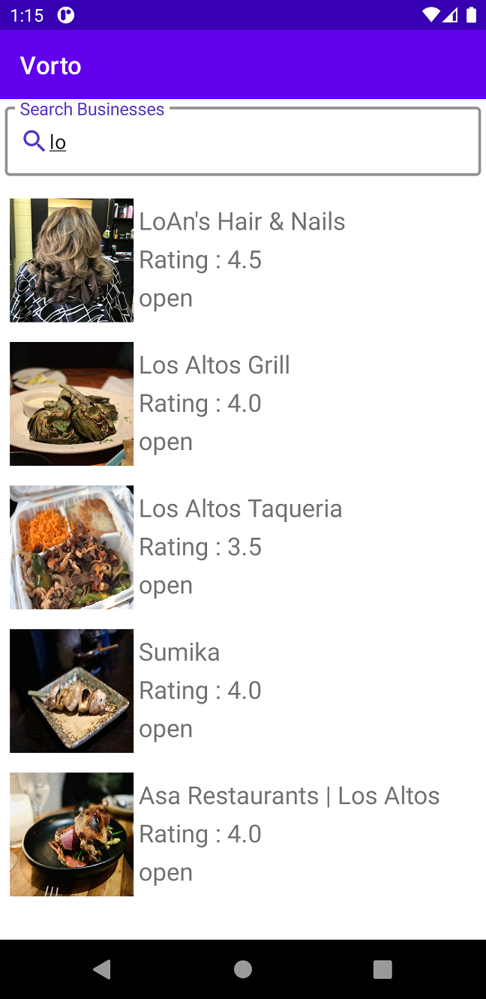
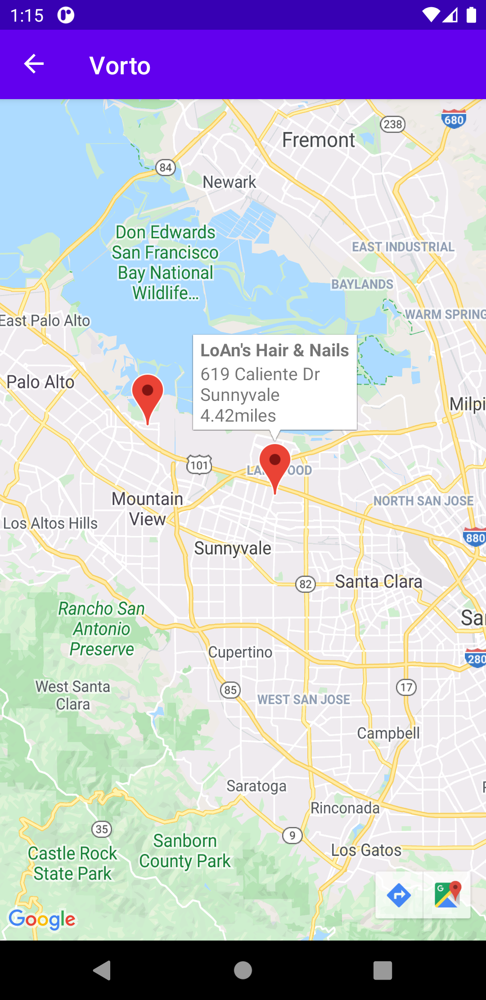

#Yelp

Android Application for Business Search based on current location
Application using Yelp Which show Results of word search with providing information of businesses 
When you tap on the result items it will provide you map with markers for your location and business location 
Tap on business marker provide information such as name,address and distance from the current location

Kotlin

MVVM Architecture

Maps API

RecyclerView

Corotuines

Repository

GSON

Picasso

Retrofit

 | 
